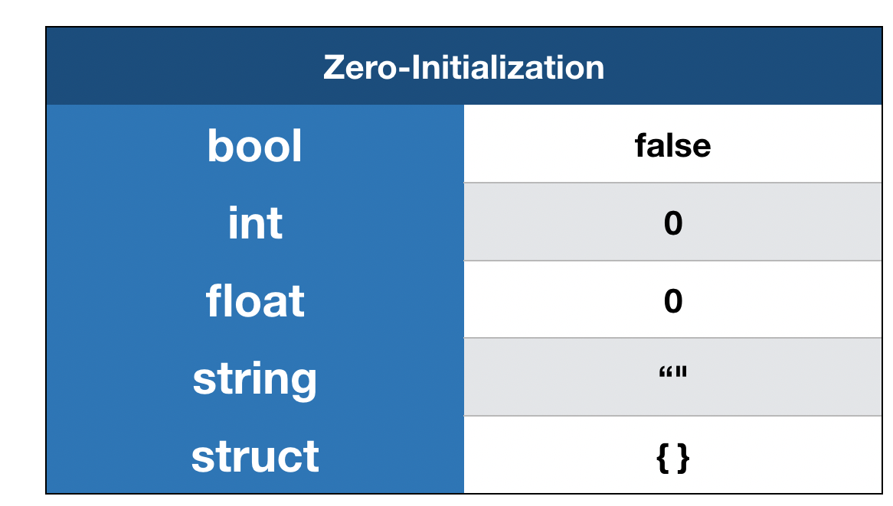
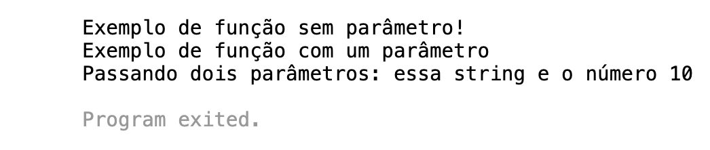

## Curso [Go: Orientação a Objetos](https://cursos.alura.com.br/course/go-lang-oo)  

### Links úteis

[Código original](https://github.com/alura-cursos/go_oo)  

### Comandos usados

```
go mod init github.com/brunosantanati/banco
```

### Outra explicações

#### Inicialização zero e nil  

Mesmo não provendo nenhum valor, o Go garante inicializar todas as variáveis, conforme a imagem abaixo:  

<!--  -->
  

Porém, em muitas linguagens existe uma maneira de denotar um ponteiro nulo que, essencialmente, não aponta para nenhum lugar. Por exemplo: em C é `NULL`, em Python é `None` e em java é `null`. Em Go, temos o `nil`.

####  Nil e Inferência  

Observe o seguinte exemplo:

```go
package main

import (
    "fmt"
)

func main() {
    a := nil
    fmt.Println(a)
}
```

Será que vai compilar?

Não, não vai. O compilador imprimirá o seguinte erro: use of untyped nil, que significa uso não tipado do nil.

Aqui estamos tentando atribuir um valor nil apontando para algum lugar sem fornecer seu tipo e esperamos que o compilador deduza isso. O compilador não sabe se esta variável é um inteiro, uma string, um array ou uma structure.

[Neste link, você pode executar o código acima.](https://play.golang.org/p/kVcneO6nVdS)

#### Nil com um tipo definido  

Sabendo disso, observe o exemplo abaixo onde apontamos para um tipo definido:

```go
package main

import (
    "fmt"
)

func main() {
    var s *string = nil
    fmt.Println(s)
}
```

Neste caso, o programa compila e retorna <nil> como esperado.

[Neste link, você pode executar o código acima.](https://play.golang.org/p/gkwKo7rholt)

#### Comparando zero value  

Para finalizar, observe o seguinte programa, no qual criamos duas variáveis: uma float64 e uma int, sem atribuir valor, e as comparamos:

```go
package main

import (
    "fmt"
)

func main() {
    var f float64
    var i int 

    fmt.Println(f==i)
}
```

[Neste link, você pode executar o código acima.](https://play.golang.org/p/Ri6dLuyhjeg)

#### Conclusão  

Recebemos uma mensagem com um erro informando que os tipos são incompatíveis. Não podemos comparar o valor atribuído pela inicialização zero se temos tipos diferentes. Portanto, por mais que o Go garanta a inicialização zero de diferentes tipos, devemos ficar atentos com os tipos que estamos trabalhando.

### Mais explicações

#### Função com quantidade de parâmetros indeterminados  

Conforme estudado nesta aula, uma função em Go pode ter um, muitos ou nenhum parâmetro:

```go
package main

import (
    "fmt"
)

func SemParametro() string {
    return "Exemplo de função sem parâmetro!"
}

func UmParametro(texto string) string {
    return texto
}

func DoisParametros(texto string, numero int) (string, int) {
    return texto, numero
}

func main() {
    fmt.Println(SemParametro())
    fmt.Println(UmParametro("Exemplo de função com um parâmetro"))
    fmt.Println(DoisParametros("Passando dois parâmetros: essa string e o número", 10))
}
```

E nossa saída seria:

  

[Neste link, você pode executar o código acima.](https://play.golang.org/p/Kq5ZXTXLVrW)

Porém, é possível que uma função receba um número indeterminado de parâmetros. Funções deste tipo são conhecidas em Go como [variadic functions](https://en.wikipedia.org/wiki/Variadic_function), ou função variádica.

#### Criando um função variádica  

Para criar uma variadic function, devemos preceder o tipo do argumento com reticências, conforme o exemplo abaixo:

```go
package main

import (
    "fmt"
)

func Somando(numeros ...int) int {
    resultadoDaSoma := 0
    for _, numero := range numeros {
        resultadoDaSoma += numero
    }
    return resultadoDaSoma
}

func main() {
    fmt.Println(Somando(1))
    fmt.Println(Somando(1,1))
    fmt.Println(Somando(1,1,1))
    fmt.Println(Somando(1,1,2,4))
}
```

[Neste link, você pode executar o código acima.](https://play.golang.org/p/s-kHUpafjOP)

Note o uso das reticências na declaração do parâmetro número: `numeros ...int`. Portanto, podemos criar uma função sem parâmetro, com um, dois, três, ou uma quantidade indeterminada de parâmetros com Go.

### Mais explicações  

#### Passando um valor ou uma cópia  

Métodos são definidos de maneira parecida com funções, mas de uma maneira diferente. Existe um (p *Pessoa) que se refere a um ponteiro para a instância criada da estrutura, conforme o exemplo abaixo:

```go
package main

import (
    "fmt"
)

type Pessoa struct {
    nome, sobrenome string
}

func (p *Pessoa) ExibirNomeCompleto() string {
    nomeCompleto := p.nome + " " + p.sobrenome
    return nomeCompleto
}

func main() {
    p1 := Pessoa{"Guilherme", "Lima"}
    fmt.Println(p1.ExibirNomeCompleto())
}
```

[Neste link, você pode executar o código acima](https://play.golang.org/p/m1yagmicHND)

Ao executar este código, temos a saída esperada:

```
Guilherme Lima

Program exited.
```

Nesse caso, passamos para o método o valor encontrado neste ponteiro através do (p *Pessoa).

#### Passando uma cópia  

Também é possível passar um valor removendo a assinatura do ponteiro `(p *Pessoa)` para (p Pessoa).

Nesse caso, uma cópia do valor de Pessoa é passada para a função, sem alterar o valor do ponteiro. Portanto, precisamos ficar atentos, já que qualquer alteração que você faça em p se passar por valor não será refletida na fonte p.

Observe este exemplo:

```go
package main

import (
    "fmt"
)

type Pessoa struct {
    nome, sobrenome string
}

func (p Pessoa) ExibirNomeCompleto() string {
    p.sobrenome = "Silva"
    nomeCompleto := p.nome + " " + p.sobrenome
    return nomeCompleto
}

func main() {
    p1 := Pessoa{"Guilherme", "Lima"}

    fmt.Println(p1.ExibirNomeCompleto())
    fmt.Println(p1.nome, p1.sobrenome)
}
```

[Neste link, você pode executar o código acima](https://play.golang.org/p/GVfCcf3ag53)

Nossa saída será:

```
Guilherme Silva
Guilherme Lima

Program exited.
```

Observe que alteramos o sobrenome de p no método ExibirNomeCompleto, mas não foi alterado o valor armazenado no ponteiro. Sendo assim, quando não precisamos alterar o conteúdo de um ponteiro, podemos passar apenas uma cópia.